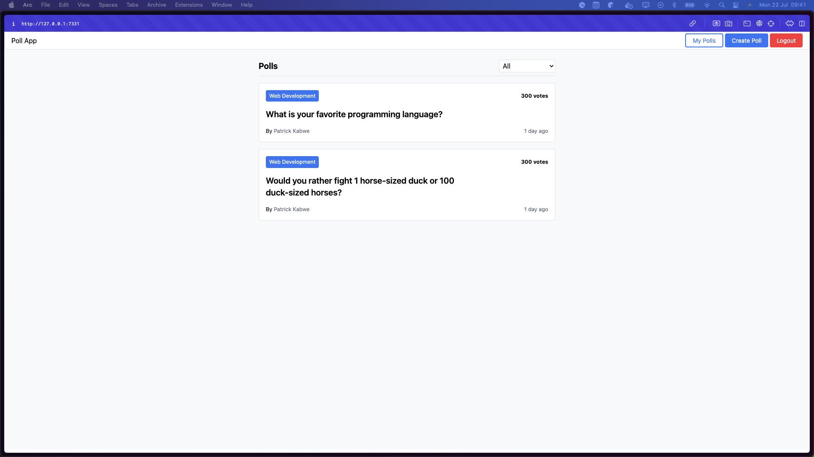

# Poll App

Poll App is a web application that allows users to create and participate in polls. It's built with Go, leveraging the Chi router for handling HTTP requests, and templ as a templating framework.



## Features

- [x] User authentication
- [x] User registration
- [x] User login
- [x] User logout
- [ ] Create a poll
- [ ] Vote on a poll
- [ ] View poll results
- [ ] View all polls
- [ ] View a single poll
- [ ] Delete a poll
- [ ] Edit a poll

## Prerequisites

Before you begin, ensure you have met the following requirements:

- Go (version 1.21 or higher)
- Docker and Docker Compose
- Node.js and npm (for TailwindCSS and other frontend dependencies)

## Setup

To set up the project for development, follow these steps:

1. Clone the repository:

```sh
git clone https://github.com/patrickkabwe/poll-app.git

cd poll-app
```

2. Install Go dependencies:

```sh
make install
```

3. Copy the .env.example file to .env and adjust the environment variables according to your setup:

```sh
cp .env.example .env
```

4. Start the database and other services using Docker Compose:

```sh
docker-compose up -d
```

### Running the Application

To run the application, use the following command from the project root:

```sh
make dev
```

This will start the Go server on the port specified in your `.env` file. You can access the web application by navigating to `http://localhost:<PORT>` in your web browser.

### Contributing

Contributions to Poll App are welcome! Here's how you can contribute:

1. Fork the repository

2. Create a new branch
   ```sh
   git checkout -b feature/your-feature-name
   ```
3. Make your changes
4. Commit your changes
   ```sh
   git commit -am 'Add new feature'
   ```
5. Push to the branch
   ```sh
   git push origin feature/your-feature-name
   ```
6. Create a new Pull Request

Please ensure your code adheres to the project's coding standards and include tests for new features or bug fixes.

### License

Poll App is open-source software licensed under the [MIT license](https://opensource.org/licenses/MIT).
